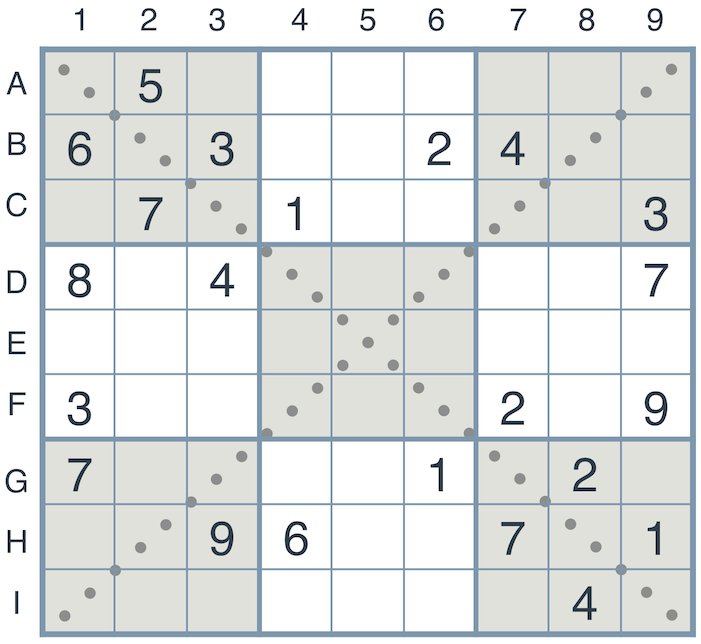

# Artificial Intelligence Nanodegree
## Introductory Project: Diagonal Sudoku Solver

# Question 1 (Naked Twins)
Q: *How do we use constraint propagation to solve the naked twins problem?*  
A: (Reminder: Constraint Propagation is all about using local constraints in a space to dramatically reduce the search space.) 

We use the naked twins technique to reduce the search space as much as possible. With this technique we search the units (square,row,column units or even diagonal units) of the sudoku puzzle for pairs of boxes which contain the same pair of numbers. In other words a naked pair is a set of two candidate numbers in two cells that have at least one unit in common. 

The naked pair may belong to only one unit or even more than one unit (for example it can belong to a square unit and column unit). After finding a naked pair we find all common units and for each unit we remove the two numbers from all boxes (that aren't the naked twins) that belong to the common units, thus reducing the search space.

# Question 2 (Diagonal Sudoku)
Q: *How do we use constraint propagation to solve the diagonal sudoku problem?*  
A: (Reminder: Constraint Propagation is all about using local constraints in a space to dramatically reduce the search space.) 

The diagonal sudoku is not very different from a conventional sudoku. The only difference is one more constraint. So, we have 4 types of units: Square,row,column and diagonal. Diagonal boxes range from the one edge to another. 

The solution is identical to the common sudoku with the only difference of the units. Four types of units instead of three. To solve the problem we apply "eliminate", "only choice" and "naked twins" recursively and progressively reducing the search space until a solution is found.

In eliminate we remove the numbers in a unit that cant go (For example, if a box has a 1 and another 1234 we remove 1 from 1234). In only choice, we try to find if a box in a unit can take a number taking into account the other constraints (For example if a unit has boxes with 1,2,3,4,5,6,7,8 and 123459 then the last one should be necessarily 9. 

The naked choice was described in the previous question. 

To summarize, we apply "only choice", "eliminate" and "naked twins" recursively until the solution is found.
I assume that that proving the correctness (That it always finds a solutions if there's one) of the algorithm is out of the scope of this project.

### Install

This project requires **Python 3**.

We recommend students install [Anaconda](https://www.continuum.io/downloads), a pre-packaged Python distribution that contains all of the necessary libraries and software for this project. 
Please try using the environment we provided in the Anaconda lesson of the Nanodegree.

##### Optional: Pygame

Optionally, you can also install pygame if you want to see your visualization. If you've followed our instructions for setting up our conda environment, you should be all set.

If not, please see how to download pygame [here](http://www.pygame.org/download.shtml).

### Code

* `solution.py` - You'll fill this in as part of your solution.
* `solution_test.py` - Do not modify this. You can test your solution by running `python solution_test.py`.
* `PySudoku.py` - Do not modify this. This is code for visualizing your solution.
* `visualize.py` - Do not modify this. This is code for visualizing your solution.

### Visualizing

To visualize your solution, please only assign values to the values_dict using the `assign_value` function provided in solution.py

### Submission
Before submitting your solution to a reviewer, you are required to submit your project to Udacity's Project Assistant, which will provide some initial feedback.  

The setup is simple.  If you have not installed the client tool already, then you may do so with the command `pip install udacity-pa`.  

To submit your code to the project assistant, run `udacity submit` from within the top-level directory of this project.  You will be prompted for a username and password.  If you login using google or facebook, visit [this link](https://project-assistant.udacity.com/auth_tokens/jwt_login) for alternate login instructions.

This process will create a zipfile in your top-level directory named sudoku-<id>.zip.  This is the file that you should submit to the Udacity reviews system.

