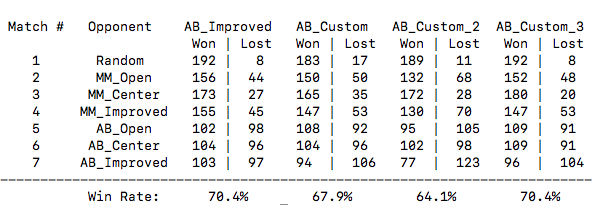

# Heuristic Analysis

### Tournament Results



As you can see the results, the heuristics I've used are all approximately at 70% success ratio with the exception of my second custom heuristic. For more accurate results I set ```NUM_MATCHES = 100 ``` in ```tournament.py```.

### The Heuristics

#### **custom_score-1()** ```67.9%```:

```
me = float(len(game.get_legal_moves(player)))

return (me - 2*opponent)
```

I modified the improved heuristic in the sample players. I'm placing more importance in the available opponent moves so that we have the computer chase the other player. Try harder, that is. The performance of this heuristic seems slightly less good than AB_Improved.


#### **custom_score-2()** ```64.1%```:


```
# Manhattan Distance from the center
w, h = game.width / 2., game.height / 2.
y, x = game.get_player_location(player)
return float(abs(h - y) + abs(w - x))
```

I take the manhattan distance from the center. It's the most complex one, so we should take this into consideration when selecting the best options. Also, it seems that it performs around 6.3% less than the best heuristics. So, complexity might be the issue.


#### **custom_score-3()** ```70.4%```:

```
me = len(game.get_legal_moves(player))
opponent = len(game.get_legal_moves(game.get_opponent(player)))

return float(me**2 - opponent**2)
```

In this heuristic I squared the ```my_moves ```and ```opponent_moves``` and took the difference. It's a heuristic that looks like the improved one since it's a difference of two quantities. However, each one will play a bigger role since it's squared:

Example:

```
6 - 1 = 5 
36 - 1 = 35

2 - 1 = 1
4 - 1 = 3
```

In cases where one player has many more moves available than the opponent this heuristic will give a higher weight than the AB_Improved method.

### Best evaluation function

```
return (me**2 - opponent**2)
```

As the best evaluation function of the three I would select the third evaluation function:

* High win rate. It seems that it performs slightly better than the other methods (But not better than the normal improved method)
* It gives consistent results.
* Also, it seems the less complex since it involves less complex instructions. Especially the second heuristic is considerably more complex. Having to call each score function millions of times it can save us time.
* It appears that it performs better the same with the improved method ```me - oppponent``` . I conclude that these two might be equally powerful. 
* One thing I noticed is that my custom heuristic doesn't perform as well **against** the improved  ```me - oppponent``` that may give an indication that the AB_Improved might be a better heuristic.