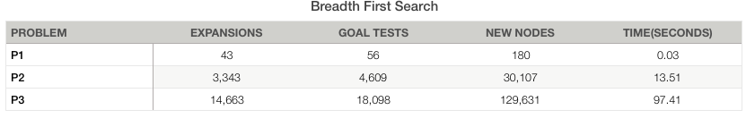
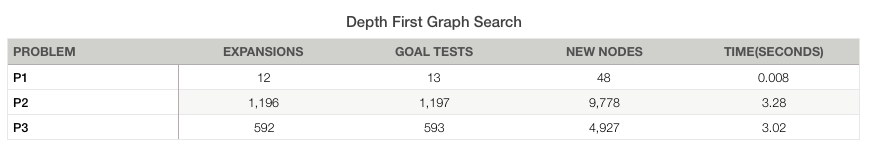

# Written Analysis

## Provide an optimal plan for Problems 1, 2, and 3.

### Problem 1
*Plan length: 6*

* Load(C1, P1, SFO)
* Load(C2, P2, JFK)
* Fly(P1, SFO, JFK)
* Fly(P2, JFK, SFO)
* Unload(C1, P1, JFK)
* Unload(C2, P2, SFO)

### Problem 2
*Plan length: 9*

* Load(C1, P1, SFO)
* Load(C2, P2, JFK)
* Load(C3, P3, ATL)
* Fly(P1, SFO, JFK)
* Fly(P2, JFK, SFO)
* Fly(P3, ATL, SFO)
* Unload(C3, P3, SFO)
* Unload(C2, P2, SFO)
* Unload(C1, P1, JFK)


### Problem 3
*Plan length: 12*

* Load(C1, P1, SFO)
* Load(C2, P2, JFK)
* Fly(P1, SFO, ATL)
* Load(C3, P1, ATL)
* Fly(P2, JFK, ORD)
* Load(C4, P2, ORD)
* Fly(P2, ORD, SFO)
* Fly(P1, ATL, JFK)
* Unload(C4, P2, SFO)
* Unload(C3, P1, JFK)
* Unload(C2, P2, SFO)
* Unload(C1, P1, JFK)
* 

## Compare and contrast non-heuristic search result metrics.
*optimality, time elapsed, number of node expansions*

(The values are normalized across the three algorithms)
### Breadth First Search(```breadth_first_search```)


### Depth First Search (```depth_first_graph_search```)


### Uniform Cost Search (```uniform_cost_search```)


Depth first search does not provide an optimal plan (Finds the first solution that may not be optimal). For example, for problem 2 the plan includes over 200 steps whereas according to other algorithms there's a plan with 9 steps.
However, the solution is found rapidly compared to the other search algorithms. Also, as it would be expected, the node expansions are also minimal compared to the other algorithms.

The Breadth first search and uniform cost search algorithms provide optimal plans(6,9,12 steps respectively). However, the nodes expansions increase by a lot with the size of the problem. The simplest problem needs around 50 expansions whereas the most complex (3d) in the range of thousands. These two algorithms run for about the same time for each problem and require similar node expansions.

## Compare and contrast heuristic search result metrics using A* with the "ignore preconditions" and "level-sum" heuristics

### What was the best heuristic used in these problems


If we exclude running time which can be a not very good metric considering python's limitations, the level sum heuristic appears to use the less expansions and goal tests. The level sum heuristic uses an order of magnitude less expansions than the ignore preconditions heuristic. The running time of the two heuristic algorithms is similar but to be accurate "ignore preconditions" takes less time. If the number of expansions (which might give an indication of space requirements) is not the first priority, it could be also a good option.

* I used pypy3 to run the algorithms

### Was it better than non-heuristic search planning methods for all problems? Why or why not?

It was better that the non-heuristic methods in the number of expanding nodes and time (However with python, time might not be the best metric due to performance issues). Usually, heuristic search produces much more efficient solutions than the uninformed searches which do not has a "compass" while searching like the heuristic algorithms do. Although heuristics provide only an estimate from the goal to each state, if the estimate is good the solution is found much more quickly. According to Norvig & Russell book a well-designed heuristic method would have an effective branching factor b* close to 1, allowing large problems to be executed with modest computational cost.

[*If the total number of nodes generated by A∗ for a particular problem is N and the solution depth is d, then b∗ is the branching factor that a uniform tree of depth d would have to have in order to contain N + 1 nodes*]